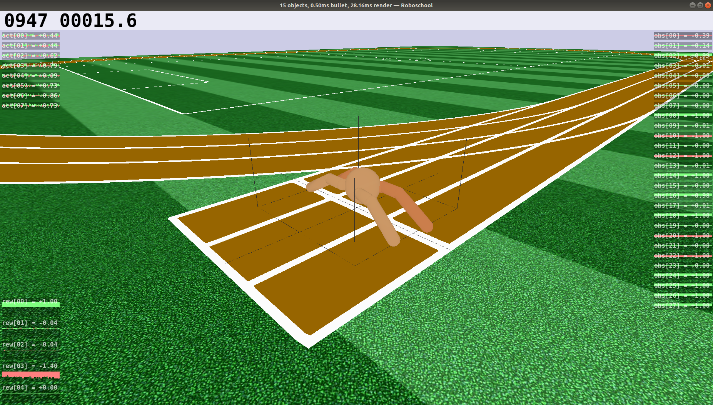
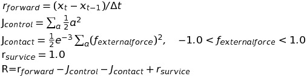

# WalkYTo-rl-gym

Walk Yourself, Toddler! Toddlers can learn by deep reinforcement learning now.


## Setup Environment

#### Basic Environment

- ubuntu 18.04
- python 3.6

#### Including (core)packages

- [gym-0.15.4](https://github.com/openai/gym)
- [roboschool-1.0.48](https://github.com/openai/roboschool)
- tensorflow-2.2
- keras-2.4.3

</br>

#### Installation from Docker Image

you can get this environment by docker image, easily.

###### Pull image from the command line:

```bash
docker pull docker.pkg.github.com/cun-bjy/walkyto-rl-gym/rl-gym
docker tag docker.pkg.github.com/cun-bjy/walkyto-rl-gym/rl-gym rl-gym
```

follow this [page](https://github.com/CUN-bjy/WalkYTo-rl-gym/packages/278485)

</br>

#### How to Run Container

**at the first time**(make a container)

```bash
xhost +local:
sudo docker run -it --name gym --env="DISPLAY" --volume="/tmp/.X11-unix:/tmp/.X11-unix:rw" rl-gym:latest
```

details:

	`--env="DISPLAY" --volume="/tmp/.X11-unix:/tmp/.X11-unix:rw"`
	
	: set to handle GUI environment from host, for Container.

</br>

**after making container**

```bash
xhost +local:
sudo docker start gym # if the container is on exit
sudo docker exec -it gym bash
```

</br>

#### Test Code on Container

```bash
#on the container
cd $HOME; python ant_v1.py
```





</br>

## About Models

#### RoboschoolAnt

similar to  *mujoco-ant* in openai-gym

- observation

  - dim = 28
  - info = 
    - **position of Torso** : (x, y, z)
    - **orientation of Torso** : (x, y, z, w)
    - **joint angles** : (hip 1,2,3,4, ankle 1,2,3,4)
    - **linear velocity of Torso** : (x, y, z)
    - **angular velocity of Torso** : (x, y, z)
    - **joint velocities** : (hip 1,2,3,4, ankle 1,2,3,4)

- actuators:

  - dim = 8
  - info =[hip_1, hip_2, hip_3, hip_4, ankle_1, ankle_2, ankle_3, ankle_4]

- rewards:

  - forward_reward : how far ANT goes on

  - control_cost : total actuator's toque

  - contact_cost : how many times the body contact on the ground

  - survive_reward : how long time the ANT goes on

    

    <p align="center"></p>


## What's New

**2020-08-10**

- **walkyto-ddpg-keras** submodule added in this package.

**2020-07-04**

- **rl-gym:0.1** package released, this package w/ **tensorflow-2.2 & keras-2.4.3**

**2020-06-20** 

- **rl-gym** environement package pre-released
